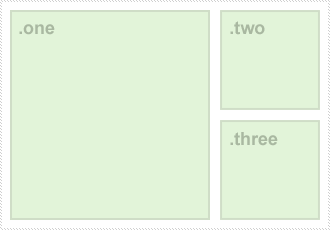

# CSS / SCSS

SCSS files that are created for the project should live in `sass/`. Files that are provided by a vendor library (for example, SymbolSet) should be in `sass/vendor`.

Files should be small and concise, focused on building modules. A good example of what should be contained in a file would be adding all type rules in `_type.scss`. Alternately, a file for forms is appropriate. Most files will live under the `sass/modules` directory.

Partials should be named using the `_{{filename}}.scss` pattern. Top-level files should be named `{{filename}}.css.scss`.

When writing SCSS, please use the following conventions:

* Use box-model impact as a sorting method for CSS properties. See [Andy Ford's post](http://web.archive.org/web/20130227044124/http://fordinteractive.com/2009/02/order-of-the-day-css-properties) on the reasons why.
  * An easy way to do this is to use the [CSSComb](http://csscomb.com/) tool (there are plugins for most editors; just make sure it's not set to use 'alphabetical').
* Put `@extends` declarations at the top of the property list (followed by an empty space)
* Put `@include` declarations at the bottom of the property list (preceded - and followed - by an empty line).
* Destroy all trailing whitespace.  

_An example that uses an @extend and an @include:_

    .complicated-rule {
      @extend %some-placeholder-rule;
     
      border: 1px solid #eaeaea;
     
      @include fancy-mixin;
    }

For more details, read [this article on CSS Tricks](http://css-tricks.com/sass-style-guide).

Finally, do not check in compiled CSS.

## Comments

Sass supports two comment styles: multiline (`/* */`) and single-line (`//`). With the exception of any licensing statements that need to be applied, the single-line style syntax should be used, as it will be removed when the CSS is compiled, making for smaller file sizes. More can be [read about this in the documentation](http://sass-lang.com/documentation/file.SASS_REFERENCE.html#comments).

### Debugging comments

While it's normal to leave debugging code enabled during development, it is crucial that this be removed before anything goes to production. There is no need for production code to have these artifacts left in them. Either re-compile using a setting that does not emit the debug code in to the output file, or run the finalized CSS through a minifier that will remove all comments.

## Variables

### Camel Case Variables

Variable names should be camelCased (much like JavaScript variables), as this helps visually differentiate them from class names (which should be dash separated), and more closely aligns them with HTML IDs (which, like the variables, should reference a single object).

    // Bad
    $some-variable: 0px;
    $some_variable: 0px;
    
    // Good
    $someVariable: 0px;

### Define a Central Variables File

To make maintenance as easy as possible, the variables used in a project should be defined in a single location. This will help prevent inadvertent overwriting, and will make the codebase easier to maintain in the long run.

### All Colors Are Variables

When applying a color to an element (be it text, border, background, or otherwise), store that color in a variable. If it's used once, it's likely that it will be used again.

## Understanding the Box Model is Key

The "box model" is a key determining factor in how a browser renders your page. A healthy understanding of it's intricacies will make your job so indescribably easier. The box model denotes the way in which the physical dimensions of a HTML element are calculated. If a block element has a fixed width of say, 100px, then how should the padding, border and margin be placed?

Plenty of websites offer in depth descriptions, but put simply: the standards compliant implementation places the border and padding outside of the specified width. It's best explained with a graphic. Consider this code:

    // the old way (178 + 20 + 2 = 200)
    .foo {
      width: 150px;
      height: 150px;
      padding: 25px;
      border: 25px solid;
      margin: 20px;
    }

### What You Would Expect (Quirks Mode)

The padding and border are calculated inward, preserving the height and width specifically set to be 150px.

### What You Get (Standards Compliant Mode)

Instead, you get 250px. 150px + (2 * 25) + (2 * 25).

If you think it seems odd, you're not alone. There is a fix at hand, and it involves a CSS property called `box-sizing`, and it works in **IE8 and above**. It allows you to choose the exact way in which an elements dimensions are calculated, and its a lifesaver. Parameter support varies and vendor prefixes apply, so consult [caniuse](http://caniuse.com/css3-boxsizing) for specifics.

    // the old way (178 + 20 + 2 = 200)
    .foo {
      width: 178px;
      padding: 10px;
      border: 1px;
    }
    
    // a better way
    .foo {
      width: 200px;
      padding: 10px;
      border: 1px;
      box-sizing: border-box;
    }

While it was always possible to mentally calculate widths by removing pixel units from each other (as per the first method), it was never entirely clear how to do so with variable width units like percentages and EMs. There was no other solution at this point besides wrapping elements in parent elements to ensure widths and `padding`/`margin`/`borders` could all be separate.

## Know when to Float, and when to Position

Gone are the days of table based layouts. The moment we admit that we can concentrate our efforts into better understanding the way floats and positions work. There's a particular mental model that needs to be grasped, and I believe this is something best done with practise.

Floats are great for sucking elements out of the DOM and forcing them hard up against a left or a right edge. They became the bread and butter of the post table layout stage in front end dev, possibly because of the poor browser support of `display: inline` and `inline-block`, as well as `z-index` bugs stemming from position support. These days there really is no excuse. Inline-block is fairly well supported, and a quick hack will get it working in IE7.

The arguments that previously held back absolutely positioning elements with CSS have thankfully died down. In theory, positioning allows you to place elements on a page (or within any container for that matter) with Xs and Ys in a straightforward manner that should be familiar to people like Flash developers.

### Understanding Positions

It's important to understand one fact when positioning elements with CSS: the position is always relative to the nearest positioned parent element. When people first start dabbling with CSS, there's a common misconception that `position: absolute;` positions right up to the page root. I think this stems from the fact that, yes, without any parent elements with position styles - this is true. It traverses up the DOM tree, not finding any positioned elements, and settles on the root of the page.

So if `position: absolute;` pulls elements out of their normal flow, how do you position an element relative to it's parent? That's straight forward. The parent element needs to by styled `position: relative;`, and then all child elements will draw from the top, right, bottom and left of this parent container. Using this knowledge, how would you go about achieving the following straightforward layout?

Using `float`, you would need to wrap the items in a clearfix, float `.one` left, and fiddle with floats and margins on both `.two` and `.three`. You would end up with something similar to the following:

    .parent {
      // poor man's clearfix
      width: 310px;
      overflow: auto;
    }

    .one {
      width: 200px;
      height: 210px;
      float: left;
    }

    .two {
      width: 100px;
      height: 100px;
      float: right;
      margin-bottom: 10px;
    }

    .three {
      width: 100px;
      height: 100px;
      float: right;
    }

As mentioned earlier, there are `z-index` issues to be considered. While the above example might seem a bit excessive, once you start thinking with positions, it will opens a world of possibilities.

## Whitespacing

Break CSS properties out in to their own lines. Any performance benefit gained from single-line rulesets can be applied when the CSS is run through the Sass compiler, and the maintainability gains we get from multi-line rulesets are worth the extra keystrokes.

### Proper Spacing

    // BAD
    .selector {display:none;background:#ff0000;color:#000000;}
    .selector { display: none; background: #ff0000; color: #000000; }
    
    // GOOD
    .selector {
     display: none;
     background: #f00;
     color: #000;
    }

### Same Line Braces

    .selector {
      display: none;
      background: #f00;
      color: #000;
    }

### Grouping & Indenting Vendor Prefixes

    .selector {
      background: #fff;
      border: 1px solid #000;
      color: #eaeaea;
      border-radius: 3px;
    }

## IDs and Classes

IDs should be written in camelCase (as is true of JavaScript and CoffeeScript), and are not to be used for styling. We build components, building-blocks with which we can construct our applications. IDs are single-use. IDs should be used to target DOM nodes with JavaScript.

Class names should be written using dash-separation, and if a class is to be used for a JavaScript behavior (state change, hiding/showing, etc), it should be prefixed with `.js-` and should not have any styles (save those needed for the JavaScript behavior) applied to it.

    // Bad
    #some-element
    .someElement
    
    // Good
    #someElement
    .some-module
    .js-toggle-visibility

## Build from small to large

Build up styles starting with the smallest of pieces. If you're building a contact page, build the button, then the form. The header and footer of the page should not need to know anything about the form, even if a form lives in the footer.

Naming should follow the [SMACSS](http://smacss.com/) methodologies / [OOCSS](https://github.com/stubbornella/oocss/wiki) principles. Focus on creating re-usable components, and not crafting hyper-specific styles.

Finally, everyone should read this article on [Cleaning Out Your SASS Junk Drawer](http://blackfalcon.roughdraft.io/4436524-clean-out-your-sass-junk-drawer).

## CSS Shorthand

### Grouping Properties

Grouping properties together is one of the single most effective methods to greatly reduce the size of a CSS file. It's important to understand how properties are ordered (clockwise - top, right, bottom, left) and how they can be further shortened (top and bottom, left and right). 

    // LONG CODE IS LONG
    padding-top: 1px;
    padding-right: 2px;
    padding-bottom: 1px;
    padding-left: 2px;
    
    // BETTER
    padding: 1px 2px 1px 2px;
    
    // BEST
    padding: 1px 2px;
    
    // Alternate SCSS-style
    padding: {
      top: 1px;
      right: 2px;
      bottom: 1px;
      left: 2px;
    }

### From 0px to Hero

Assigning a unit type to a property value of zero is redundant. It is not important to know whether an element should be `0px` from the left or `0 elephants` from the left, just that it's flush left.

    // BAD
    padding: 0px 10px;
    
    // GOOD
    padding: 0 10px;

### Commenting Blocks

Commenting large blocks of CSS is a great way of keeping track of multiple style areas within the one stylesheet. Obviously it works better with single line CSS styles, but the effect is not entirely lost on multi-line either. The use of dashes versus equals versus underscores are all up the individual, but this is how I like to manage my stylesheets.

    // Horizontal Nav
    // --------------
    
    #horizNav {
      width: 100%;
      display: block;
    
      li {
        display: block;
        float: left;
        position: relative;
      
        a {
          display: block;
          height: 30px;
          text-decoration: none;
        }
        
        ul {
          display: none;
          position: absolute;
          top: 30;
          left: 0;
        }
      }
    }
    
    // Home Page - Carousel
    // --------------------
    
    #carousel {
      width: 960px;
      height: 150px;
      position: relative;
    
      img {
        display: none;
      }
    
      .buttons {
        position: absolute;
        right: 10px;
        bottom: 10px;
      }
    }

## Clearing Floats

Clearing a `
` used to mean extra DOM, because it involved adding an extra clearer element. The better way is to set a specific width on the parent element ("auto" doesn't work in all browsers and scenarios) and an overflow value of either "auto" or "hidden". "Hidden" obviously degrades better, but there are some IE compatibility versions where "auto" works better.

### The HTML:

    

      

        I'm floated left!
      

      I'm normal text that wraps around the float
    

### The CSS:

    .parent-element {
      width: 100%;
      overflow: hidden;
    }
    
    .child-element {
      float: left;
    }

Alternately, the [micro clear-fix](http://nicolasgallagher.com/micro-clearfix-hack/) is considered stable and cross browser compliant enough to make it to the latest HTML5 boiler plate release. I **highly** recommend you check it out. Although I am not a massive fan of browser-specific CSS and pseudo elements such as `:after`, the micro clearfix is definitely more robust. It also prevents top margins from collapsing which is an absolute life saver.

## Vertical & Horizontal Centering

Centering elements horizontally is not exactly rocket science, and I'm sure most of you are familiar with the following snippet:

    .class {
      width: 960px;
      margin: 0 auto;
    }

Front end devs have been using this snippet for a long time, without fully understanding why it didn't work vertically. From my understanding, it's important to remember that the parent element will generally have a `height: auto;` on it, and that there is no 100% height in which to vertically center the element. Applying the `position: absolute;` effectively moves the element out into position mode and responds to the pushing and pulling of auto margins and no specific location. 

    .exact-middle {
      width: 100px;
      height: 100px;
      position: absolute;
      top: 0;
      right: 0;
      bottom: 0;
      left: 0;
      margin: auto;
    }

The downsides of this method include its lack of support in IE6 and IE7, and the absence of a scroll bar if the browser is resized to be smaller than the centered object. There are more methods on [this page](http://blog.themeforest.net/tutorials/vertical-centering-with-css/) (this is Method 4), but this is by far the best.

The vertical centering of text in an element is also straightforward. If the text is on a single line, like a horizontal navigation item, you can set the `line-height` to be that of the element's physical height.

    #horizNav li {
      height: 32px;
      line-height: 32px;
    }

## Feature Sniff, Don't Browser Sniff

In the earlier discusison of JavaScript feature detection, applying properties if a browser is *any version* of IE is increasingly problematic. Man-of-steel Paul Irish pioneered the use of [IE version](http://paulirish.com/2008/conditional-stylesheets-vs-css-hacks-answer-neither/) sniffing to address this problem, but [Modernizr](http://www.modernizr.com/) has since come to the rescue. Modernizr places classes on the root `<html>` element specifying whether features are supported. Bleeding edge styles can then easily cascade from (or be removed from) these classes.

    .my-elem {
      box-shadow: 0 1px 2px rgba(0,0,0,0.25);
    }
    
    // when box shadow isn't supported, use borders instead
    .no-boxshadow .my-elem {
      border: 1px solid #666;
      border-bottom-width: 2px;
    }

## You're Not !important

A reliance upon the `!important` tag is a dangerous thing. The cases that warrant its use are rare and specific. They revolve around the necessity to override another stylesheet which you do not have access or permission to edit. Another scenario is hard coding an element's styles to prevent inline JavaScript styles from taking precedence. Instead `!important` is used as a lazy shortcut to set the priority of your style over another, causing headaches further down the line.

The use of the `!important` tag can be mostly avoided via the better understanding of CSS selector precedence, and how to better target elements. The more specific the selector, the more likely it will be accepted as the applicable style. The following example from vanseodesign demonstrates the specificity at work.

    p {
      font-size: 12px;
    }
    
    p.bio {
      font-size: 14px;
    }

[Their article](http://www.modernizr.com/) on style precedence does a better job explaining inheritence than I ever could, so please give it a go.

## Aggressive Degradation

It's worth noting that this is a personal opinion, and best suited to very specific situations. The stance of aggressive degradation will not be well received in large commercial projects or enterprise solutions relying upon older browsers.

Aggressive degradation dictates that if a particular (older) browser cannot render a certain effect, it should simply be omitted. A CSS3 button is a good example. Effects such as `border-radius`, `box-shadow`, `text-shadow`, and `gradients` will be displayed in cutting edge browsers. A graceful fallback of a `.PNG` would be provided for slightly older browsers, and the most graceful of all solutions would include a PNG-Fix for IE6 or the use of `filter` arguments to replicate gradients and shadows. However, aggressive degradation in this situation instructs you to neglect the older browsers and present them with a flat, satisfactory object.

Put simply, aggressive degradation boils down to: **if your browser can't render a gradient or a box shadow, tough luck**.

While not ideal for every situation, it ensures the timely delivery of projects and that the root product is still usable and not reliant on (validation breaking) hacks.
